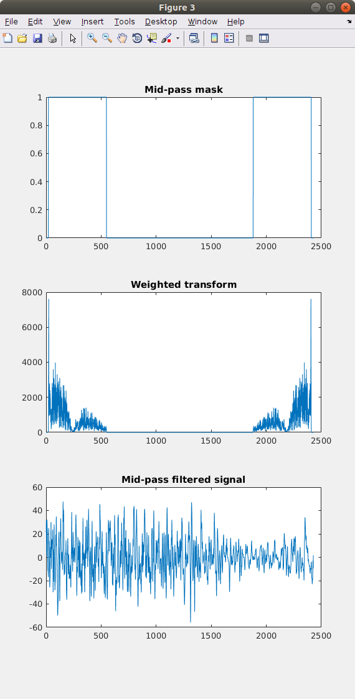

# EEGVL
# Code Description.

The approach taken to complete this task consisted in three stages:

1.- Load and exploration.
2.- Artifact removal.
3.- Spectral Classification.

All the code discussed here was developed to complete this task with minimal invokation of toolboxes.

## Load and exploration.

This module is contained in the script **eeglx.m**. Excecuting this script will open the file and extract each trial signals allocating it in arrays which are eventually then processed and analysed. I used the sampling frequency and the length of the signal to construct the respecitve time domains, as show in the image below.

<!-- img src="F2.png" alt="Drawing" style="width: 20%;"/ -->

## Artifact Removal.

Once the data has ben loaded and stored in matrices in the workspace the script **preprop.m** detrends and returns spectra for each channnel and arrays of regularised signals. This script has to be exceuted per EEG set.

The final step is to excecute **avp.m** which averages.  Then **psel.m** evaluates the spectral estimator and classifier.

The averages, estimator and classifier codes are contained in **pclass.m**, **logclass.m**

All the other files are for plotting.

